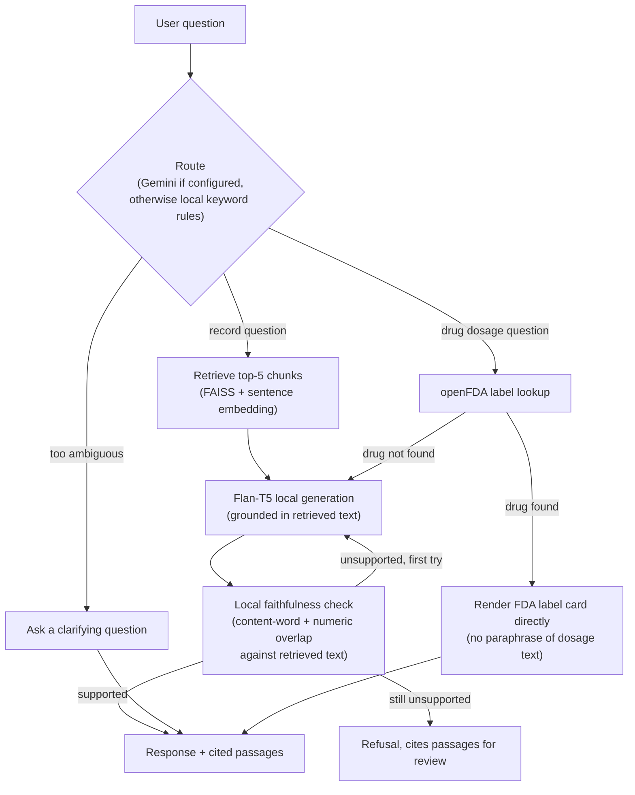

<h1 align="center">🏥 Clinical Evidence Assistant: Medical Q&A on MIMIC-IV Discharge Notes</h1>

<p align="center">
  An agentic, evidence-grounded assistant that answers clinical questions from real hospital discharge notes. Retrieval and generation run entirely locally. For restricted-data runs, keep optional external Gemini features disabled; the fully local routing and faithfulness checks remain functional without an API key.
</p>

<p align="center">
  
  
  
  
  
  
</p>

## 🔎 System Scope

Clinical Evidence Assistant answers questions over real de-identified discharge notes from the MIMIC-IV dataset. Ask a plain-language clinical question and it retrieves the relevant sections, routes to the right tool (record lookup or an FDA label lookup), generates an answer locally, and checks that answer against the retrieved text before showing it. If the notes don't contain the answer, it says so instead of guessing.

The default restricted-data mode works entirely on CPU with no paid APIs and no data leaving the local machine. All results are presented through a two-tab Flask dashboard where one tab is for asking questions and the other shows the full pipeline, EDA and evaluation results.

## 🧪 Evaluation

`evaluation.py` provides a 10-question keyword-matching harness for local testing after retrieval or generation changes. Runs against MIMIC-IV-Note write their responses, scores, latency measurements, and plots under the ignored `outputs/` directory. The individual questions, generated answers, and retrieved passages from that run are never published, since they are derived from restricted clinical text. The two aggregate numbers below are safe to share on their own, since they describe pipeline performance and reveal nothing about the underlying notes.

Anyone without credentialed PhysioNet access can still verify the pipeline using the fabricated demo corpus. Run `python -m scripts.evaluate_demo` to reproduce the demo numbers without needing access to restricted clinical data.

| Metric | Real dataset (MIMIC-IV-Note v2.2) | Synthetic demo |
|---|---|---|
| Overall Accuracy | 70% (7/10) | 80% (8/10) |
| Mean Latency | ~3.4s per question | ~4.6s per question |

The real-dataset row is measured on de-identified MIMIC-IV-Note discharge summaries under credentialed PhysioNet access. No note text, generated answer, or retrieved passage from that run is included in this repository, only the two aggregate numbers above. The demo row is measured on the fabricated notes in `scripts/synthetic_demo_notes.py` and is fully reproducible by anyone who clones this repository.

## 🗂️ Dataset

| Detail | Value |
|---|---|
| Name | MIMIC-IV Clinical Discharge Notes |
| Source | PhysioNet (credentialed access required) |
| Total Notes | 331,793 |
| Unique Patients | 145,914 |
| Local Corpus | Random sample across the full dataset, no condition filtering; all derived chunks, indices, and measurements stay in the ignored `outputs/` directory |

Access requires completing CITI training and signing a PhysioNet Data Use Agreement. The dataset is not included in this repository. Earlier versions of this pipeline embedded only a diabetes-filtered subset; it now draws a random sample from across all conditions so the assistant can answer general clinical questions, not just diabetes-related ones.

## 🧪 Demo Mode (no credentialed access required)

The DUA above is a real constraint on public deployment, not just on this repository: it requires "I will not share access to PhysioNet restricted data with anyone else," and a live app that returns excerpts from real discharge notes to anonymous visitors would do exactly that, regardless of how the underlying files are stored. So a public-facing deployment (a shared demo link, a portfolio project) needs a dataset that was never restricted in the first place.

`scripts/synthetic_demo_notes.py` holds ten fully fabricated discharge notes. No real patient, no real admission, every vital, lab, and diagnosis was invented for this project, written in the same section-header format MIMIC-IV-Note uses, so the existing chunking/embedding/retrieval/generation pipeline treats them identically to real notes. `scripts/build_demo_index.py` runs them through that same pipeline into `outputs_demo/`, a separate, git-safe directory from the real `outputs/` (which must never be committed).

To reuse this if you fork or extend the project:

```bash
# Build the demo index once, or after editing synthetic_demo_notes.py
python -m scripts.build_demo_index

# Point the app at it (in .env, or as platform environment variables on deploy)
OUTPUT_DIR=outputs_demo/
DATASET_LABEL=Synthetic demo (fabricated notes; no patient data; real MIMIC-IV-Note data requires credentialed PhysioNet access)

# Optional: measure the demo's own accuracy the same way the real one is measured
python -m scripts.evaluate_demo
```

The existing "Dataset" field in the UI reads `DATASET_LABEL` directly, so a demo deployment always honestly discloses what it's running on, with no separate banner or UI change needed.

See the Evaluation section above for the demo's measured accuracy and latency alongside the real dataset's.

### Public deployment (Vercel)

The live public demo deployed on Vercel does not, and cannot, run the full pipeline above. `requirements.txt` (the public runtime's dependency list) contains only Flask and python-dotenv -- deliberately, not by oversight. The full pipeline needs `torch` + `transformers` + `sentence-transformers` + `faiss-cpu`, which together pull in several hundred megabytes of model weights. Vercel's serverless functions have a hard deployment size limit and no persistent writable disk to cache a Hugging Face model download across invocations, so shipping those dependencies would either fail to deploy outright or re-download hundreds of megabytes on every cold start. This is a platform constraint, not a configuration choice: there is no `requirements.txt` change that makes the full pipeline run reliably on Vercel's standard serverless functions. Achieving true parity would mean moving off Vercel's serverless model entirely (a persistent container platform such as Render, Railway, or a small VM), which is a larger decision than a code fix.

Given that constraint, `demo_runtime.py` implements a separate, much simpler, fully self-contained runtime instead: it matches question keywords directly against the fabricated notes' own section headers and returns the matching section verbatim, with no embeddings, no vector search, and no generation model. `app.py`'s module-level `app` object is pinned to this runtime, so an environment-variable mistake cannot accidentally serve real data on Vercel.

This is a genuinely different answering method from the local full-pipeline demo above, so it has its own separately measured accuracy rather than reusing the 80% figure: `python -m scripts.evaluate_public_demo` runs the same 10-question keyword-hit set directly against `demo_runtime.run_turn`, with no model loading required.

| Metric | Public Vercel demo (deterministic extractive) |
|---|---|
| Overall Accuracy | 100% (10/10) on this app's own fixed question set |
| Mean Latency | <1ms per question |

This number should not be read as "the deployed demo is more accurate than the real pipeline." It is measured only against this project's own 10 canonical questions, and those questions were written using the same category vocabulary (diagnosis, medications, disposition, allergies, and so on) as `demo_runtime.py`'s section-matching rules, so the test is close to circular: it mostly confirms the method can find a section when asked with its own target words. Testing informally with realistic rephrasings surfaces real failures the fixed set doesn't catch. One such bug was found and fixed directly: "What was the patient prescribed to take at home?" used to match the **Discharge Disposition** section instead of medications, because the standalone word "home" was one of the keywords that triggered that category; "home" was removed from that trigger list once the collision was confirmed. A remaining, unfixed example: "What time was the patient discharged?" still matches Discharge Disposition (the closest available section) even though none of these fabricated notes record a discharge time, rather than recognizing it has no answer and saying so.

So 100% describes how well the method finds its own target categories when asked in expected phrasing, not general question-answering reliability. The 70%/80% figures above are a meaningfully harder test (open-ended generation, not exact-phrase matching) and are not directly comparable to this number.

## 🧠 How It Works

**Offline, once:** each discharge note goes through 8-step cleaning and section-aware chunking, gets embedded (384-dim), and lands in a FAISS `IndexFlatIP` index.

**Per question, live:** the question is routed to the right tool, not just handed straight to a retriever. This is an agent graph (`agent/graph.py`, built on LangGraph), not a single retrieve-then-generate pass.



The local faithfulness check is what actually gates a refusal. It runs on every turn, entirely on-device, and gets one retry if the first draft doesn't hold up. An optional external Gemini call can additionally annotate structural quality (coherence, hedging) if `GEMINI_API_KEY` is set, but it's advisory only and off by default, so it never overrides the local check. Because routing context and generated drafts can contain clinical facts, external Gemini features are for fabricated or otherwise unrestricted data only; leave `GEMINI_API_KEY` blank for MIMIC-IV-Note runs.

## ⚙️ Pipeline Configuration

| Parameter | Value |
|---|---|
| Embedding Model | `all-MiniLM-L6-v2` (384 dimensions) |
| FAISS Index Type | `IndexFlatIP` (cosine similarity via L2 normalisation) |
| Chunking Strategy | Section-aware (16 MIMIC headers), hierarchically sub-chunked at 180 words so long sections don't exceed the embedding model's 256-token limit |
| Chunk Overlap | 40 words |
| Top-K Retrieval | 5 chunks per query, de-duplicated against near-identical overlapping passages, re-ranked by a header-relevance boost (a chunk whose own section header lexically matches the question's words is favored, see `retrieval.py`'s `_header_boost`) |
| Generation Model | `google/flan-t5-base` |
| Repetition Controls | `repetition_penalty=1.15`, `no_repeat_ngram_size=4`, which suppresses the model re-emitting the same line multiple times, tuned down from an initial 1.3/3 after that stronger setting was found to also strip dose details (e.g. "60 mg PO daily") from medication lists |
| Embedding Batch Size | 64 |

**System prompt used** (see `generation.py` for the exact current version, including the one-shot example that teaches the model to answer in prose rather than copying the source's own numbering):
```
You are a clinical assistant answering questions about hospital discharge notes
covering a range of clinical conditions.
Answer the question below using only the context provided.
Include every distinct item the context mentions that is relevant to the question.
Use exact medical terms, doses, and values from the context, but write the answer
in your own words as complete sentences -- never copy numbering or list markers
from the context, and never state the same fact twice.
Be specific and complete rather than brief.
If the answer is not in the context, say: I cannot find this information in the provided notes.
```

## 🧹 Preprocessing Pipeline

Each discharge note goes through 8 steps before chunking:

1. Remove MIMIC de-identification placeholders
2. Remove empty lines containing only underscores or whitespace
3. Lowercase all text
4. Normalise whitespace to single spaces
5. Filter to keep only letters, numbers and basic punctuation
6. Tokenise using NLTK
7. Remove standard and custom clinical stop words and short tokens, **except negation terms** (no, not, nor, without, denies, ...). Clinical NLP research on MIMIC notes ([Wu et al. via ResearchGate](https://www.researchgate.net/publication/384777146_An_Efficient_Text_Cleaning_Pipeline_for_Clinical_Text_for_Transformer_Encoder_Models); [assertion detection survey, arXiv:2503.17425](https://arxiv.org/html/2503.17425v1)) flags that blanket stopword removal erases the ~13% of clinical findings that are negated, flipping "no chest pain" and "chest pain" into the same bag of words
8. Lemmatise using WordNetLemmatizer with POS tags

> **Note:** this cleaned/lemmatised text is used for the EDA visualisations (word clouds, word-frequency plots) only. The RAG knowledge base itself is built from the section-aware chunker operating on the *raw* note text (see below), so it was never affected by stopword removal in the first place. The fix above corrects what the preprocessing EDA represents, not the retrieval corpus.

## 🗂️ Repository Structure

```text
clinical-rag-mimic/
├── app.py              # Flask dashboard + /ask endpoint
├── config.py           # Central config, reads all settings from .env
├── agent/              # LangGraph agent: routing, tools, reflection, Gemini calls
├── chunking.py         # Section-aware chunking with fallback
├── data.py             # Data loading, EDA, condition subsets
├── embeddings.py       # Embedding generation and FAISS index
├── evaluation.py       # 10-question evaluation, saves results and plots
├── generation.py       # Flan-T5 loader, prompt builder, answer generation
├── preprocessing.py    # 8-step cleaning pipeline
├── retrieval.py        # Chunk retrieval functions
├── viz_style.py        # Shared matplotlib/seaborn styling for all plots
├── requirements.txt    # Lightweight public deployment dependencies
├── requirements-local.txt # Full local RAG and research dependencies
├── train.py            # Runs full pipeline and saves all outputs
├── .env.local.example  # Copy to .env for the full local pipeline (.env is gitignored)
├── scripts/
│   ├── synthetic_demo_notes.py   # Fabricated notes for the public demo (see Demo Mode above)
│   ├── build_demo_index.py       # Builds outputs_demo/ from the synthetic notes
│   ├── evaluate_demo.py          # Same keyword-hit evaluation as evaluation.py, for the demo index
│   └── regenerate_ui_charts.py   # Regenerates ignored OUTPUT_DIR/ui_charts from local caches
├── outputs_demo/        # Demo FAISS index + chunk store -- synthetic, safe to commit
├── static/              # CSS, JS, fonts, and project-created brand assets
├── templates/           # Flask HTML templates
└── tests/               # pytest unit tests + Playwright browser tests
```

> **Note:** the `mimic-iv-note-deidentified-free-text-clinical-notes-2.2/` dataset folder and the `outputs/` folder are not included in this repository. The dataset requires credentialed PhysioNet access. The `outputs/` folder containing the preprocessed sample, FAISS index and chunk data is generated locally when you run `python train.py`.

## ⚙️ Setup and Usage

```bash
# 1. Clone the repository
git clone https://github.com/abinashprasana/clinical-rag-mimic.git
cd clinical-rag-mimic

# 2. Install dependencies
pip install -r requirements-local.txt

# 3. Download the dataset
# Get the MIMIC-IV-Note package from PhysioNet (requires credentialed MIMIC-IV access)
# https://physionet.org/content/mimic-iv-note/
# Extract it so discharge.csv.gz ends up at:
# mimic-iv-note-deidentified-free-text-clinical-notes-2.2/note/discharge.csv.gz
# (relative to the repository root, see DATA_PATH in data.py)

# 4. Run the training pipeline
python train.py

# 5. (Optional, synthetic/unrestricted data only) Enable Gemini routing/clarification
cp .env.local.example .env
# Get a free key at https://aistudio.google.com/apikey, then set it in .env:
# GEMINI_API_KEY=your-key-here
# Leave GEMINI_API_KEY blank for MIMIC-IV-Note or any other restricted data.
# Routing context and optional structural reflection can contain derived facts.
# .env is gitignored, so never commit it, and never paste a real key into a
# commit, issue, or chat. The app runs fine with no key at all (it falls
# back to local keyword-based routing); a key only upgrades that path.
# On a hosting platform, set GEMINI_API_KEY as a platform environment
# variable/secret rather than shipping a .env file with the deployment.

# 6. Launch the Flask dashboard
python app.py
```

Then open `http://localhost:5000` in your browser.

## 🧪 Limitations and Future Work

The embedding model and generative model are both general-purpose and were not trained on clinical or biomedical text. It's tempting to assume a domain-specific model like Bio_ClinicalBERT would improve retrieval, but a 2024 benchmark of clinical semantic search ([Kanithi et al., arXiv:2401.01943](https://arxiv.org/html/2401.01943v2)) found the opposite for short-context retrieval: generalist sentence-transformer models beat clinical-specific ones (their top generalist model hit 84.0% exact-match vs. 64.4% for the best clinical model, ClinicalBERT), so `all-MiniLM-L6-v2` is a reasonable choice here, not a placeholder to be swapped out. A domain-specific generation model (e.g. BioGPT) is more likely to help than a domain-specific embedding model would. The local corpus size is configurable, but restricted-data-derived corpus measurements and artifacts are deliberately kept out of the public repository. Because retrieval returns the single most relevant note, definitional questions ("What is hypertension?") tend to surface that patient's specific diagnosis rather than a general definition. That's correct grounded behaviour for this design, but worth knowing if you extend the evaluation set. The keyword-based evaluation is rigid and may penalise correct answers that use different but valid medical vocabulary. The pipeline is built on a single institution dataset from MIMIC-IV and may not generalise well to discharge notes from other hospitals or healthcare systems.

## 📌 Dataset Source

**MIMIC-IV-Note v2.2 (PhysioNet)**
Johnson et al. (2023). Available at: https://physionet.org/content/mimic-iv-note/
Credentialed access required. Open Government Licence.

## 🙋 Author

**Abinash Prasana Selvanathan**

⭐ If you found this useful, feel free to star the repo.
