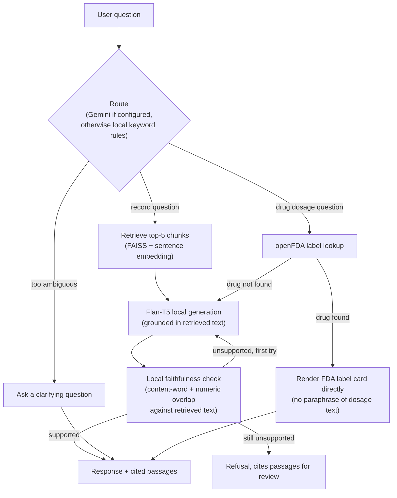

<h1 align="center">🏥 Clinical Evidence Assistant: Medical Q&A on MIMIC-IV Discharge Notes</h1>

<p align="center">
  An agentic, evidence-grounded assistant that answers clinical questions from real hospital discharge notes. It routes each question to the right tool, retrieves the supporting passages, and checks its own answer against them before showing it.
</p>

<p align="center">
  <a href="https://clinical-rag-mimic-ecvl.vercel.app/"></a>
  
  
  
  
  
  
</p>

<p align="center">
  <b>Live demo:</b> <a href="https://clinical-rag-mimic-ecvl.vercel.app/">clinical-rag-mimic-ecvl.vercel.app</a>
</p>

> **What the live demo runs on.** The hosted app answers from **ten fabricated discharge notes**, never from MIMIC-IV-Note. The PhysioNet Data Use Agreement forbids sharing access to the restricted data, and a public site returning real note excerpts to anonymous visitors would do exactly that. It performs genuine retrieval-augmented generation over those fabricated notes through the Gemini API, with the same faithfulness check the local pipeline uses. See [Demo Mode](#-demo-mode-no-credentialed-access-required) for why, and [Public deployment](#public-deployment-vercel) for how.
>
> The **local** pipeline is the one that runs on real data, and it runs entirely on CPU with no data leaving the machine. Keep `GEMINI_API_KEY` blank for MIMIC-IV-Note runs: routing and clarification are the only steps that would call out, and they fall back to local keyword rules without a key.

## 🔎 System Scope

Clinical Evidence Assistant answers questions over real de-identified discharge notes from the MIMIC-IV dataset. Ask a plain-language clinical question and it retrieves the relevant sections, routes to the right tool (record lookup or an FDA label lookup), generates an answer locally, and checks that answer against the retrieved text before showing it. If the notes don't contain the answer, it says so instead of guessing.

The default restricted-data mode works entirely on CPU with no paid APIs and no data leaving the local machine.

The interface opens on a case-study page covering what the system is, the two datasets behind it, the measured results for each, and what it deliberately does not decide. From there it hands over to a two-tab workspace where one tab is for asking questions and the other shows the full pipeline, EDA and evaluation results.

## 🧪 Evaluation

`core/evaluation.py` provides a 10-question keyword-matching harness for local testing after retrieval or generation changes. Runs against MIMIC-IV-Note write their responses, scores, latency measurements, and plots under the ignored `outputs/` directory. The individual questions, generated answers, and retrieved passages from that run are never published, since they are derived from restricted clinical text. The two aggregate numbers below are safe to share on their own, since they describe pipeline performance and reveal nothing about the underlying notes.

Anyone without credentialed PhysioNet access can still verify the pipeline using the fabricated demo corpus. Run `python -m demo.evaluate` to reproduce the demo numbers without needing access to restricted clinical data.

| Metric | Real dataset (MIMIC-IV-Note v2.2) | Synthetic demo |
|---|---|---|
| Overall Accuracy | 70% (7/10) | 80% (8/10) |
| Mean Latency | ~3.4s per question | ~4.6s per question |

The real-dataset row is measured on de-identified MIMIC-IV-Note discharge summaries under credentialed PhysioNet access. No note text, generated answer, or retrieved passage from that run is included in this repository, only the two aggregate numbers above. The demo row is measured on the fabricated notes in `demo/notes.py` and is fully reproducible by anyone who clones this repository.

## 🗂️ Dataset

| Detail | Value |
|---|---|
| Name | MIMIC-IV Clinical Discharge Notes |
| Source | PhysioNet (credentialed access required) |
| Total Notes | 331,793 |
| Unique Patients | 145,914 |
| Local Corpus | Random sample across the full dataset, no condition filtering; all derived chunks, indices, and measurements stay in the ignored `outputs/` directory |

Access requires completing CITI training and signing a PhysioNet Data Use Agreement. The dataset is not included in this repository. Earlier versions of this pipeline embedded only a diabetes-filtered subset; it now draws a random sample from across all conditions so the assistant can answer general clinical questions, not just diabetes-related ones.

## 🧪 Demo Mode (no credentialed access required)

The DUA above is a real constraint on public deployment, not just on this repository: it requires "I will not share access to PhysioNet restricted data with anyone else," and a live app that returns excerpts from real discharge notes to anonymous visitors would do exactly that, regardless of how the underlying files are stored. So a public-facing deployment (a shared demo link, a portfolio project) needs a dataset that was never restricted in the first place.

`demo/notes.py` holds ten fully fabricated discharge notes. No real patient, no real admission, every vital, lab, and diagnosis was invented for this project, written in the same section-header format MIMIC-IV-Note uses, so the existing chunking/embedding/retrieval/generation pipeline treats them identically to real notes. `demo/build_index.py` runs them through that same pipeline into `outputs_demo/`, a separate, git-safe directory from the real `outputs/` (which must never be committed).

To reuse this if you fork or extend the project:

```bash
# Build the demo index once, or after editing demo/notes.py
python -m demo.build_index

# Point the app at it (in .env, or as platform environment variables on deploy)
OUTPUT_DIR=outputs_demo/
DATASET_LABEL=Synthetic demo (fabricated notes; no patient data; real MIMIC-IV-Note data requires credentialed PhysioNet access)

# Optional: measure the demo's own accuracy the same way the real one is measured
python -m demo.evaluate

# For the public Vercel deployment specifically (see below): also precompute
# Gemini embeddings for the same chunks, once or after editing the notes
python -m demo.build_gemini_embeddings
```

The existing "Dataset" field in the UI reads `DATASET_LABEL` directly, so a demo deployment always honestly discloses what it's running on, with no separate banner or UI change needed.

See the Evaluation section above for the demo's measured accuracy and latency alongside the real dataset's.

### Public deployment (Vercel)

Live at **[clinical-rag-mimic-ecvl.vercel.app](https://clinical-rag-mimic-ecvl.vercel.app/)**.

The live public demo deployed on Vercel doesn't load SentenceTransformers/FAISS/FLAN-T5 in-process the way the local pipeline does. `requirements.txt` (the public runtime's dependency list) is small deliberately, since those packages together pull in several hundred megabytes of model weights that exceed Vercel's serverless function size limit. But it still runs real retrieval-augmented generation, not a stand-in: `demo/runtime.py` gets the same two model calls (embed the question, generate the answer) from Google's Gemini API instead of loading the models locally, so the deployed function stays small while doing genuine RAG.

Concretely, `demo/runtime.py`:
- Embeds the incoming question via Gemini's `gemini-embedding-001` and matches it against `outputs_demo/gemini_chunk_embeddings.pkl`, precomputed embeddings for the exact same 101 chunks (`outputs_demo/chunks_data.pkl`) the local pipeline retrieves against, re-ranked with the same header-relevance boost `core/retrieval.py` uses for the real dataset.
- Generates the answer with Gemini (`gemini-flash-lite-latest`, a separate model from `GEMINI_MODEL`) from the retrieved passages, using the same system prompt as the local FLAN-T5 pipeline. This is deliberately not the same model the local app uses for routing/reflection: that model's free tier caps `generateContent` at only 20 requests/day, discovered by hitting that exact limit during development, which is nowhere near enough for a public demo answering anonymous visitors. `gemini-flash-lite-latest`'s free tier (roughly 1,000-1,500 requests/day) is sized for that instead, on a completely separate quota.
- Runs that generated answer through the same local faithfulness check (`agent/reflection.py`'s content-word/numeric overlap check) the local pipeline uses, with one retry if it fails, before ever showing it.
- Falls back to a fully offline, deterministic keyword-matching method if `GEMINI_API_KEY` isn't configured or any Gemini call fails for any reason (quota, network, timeout). The app stays functional either way, just cruder without a key, the same pattern `agent/llm.py` already uses for local routing.

`python -m demo.evaluate_public` runs the same 10-question keyword-hit check against this pipeline. Its result is reported as a raw count, not a percentage, and deliberately not placed in the accuracy table above: a bare "100%" sitting next to the real dataset's 70% and the local synthetic demo's 80% would misleadingly read as "the deployed demo beats the real research pipeline," when all three numbers are actually the same small 10-question smoke test, not a benchmark that scales to general reliability.

| Metric | Public Vercel demo (Gemini-backed RAG) |
|---|---|
| Canonical checks passed | 10/10 (not a benchmark; see note above) |
| Mean Latency | ~1.5s per question |

## 🧠 How It Works

**Offline, once:** each discharge note goes through 8-step cleaning and section-aware chunking, gets embedded (384-dim), and lands in a FAISS `IndexFlatIP` index.

**Per question, live:** the question is routed to the right tool, not just handed straight to a retriever. This is an agent graph (`agent/graph.py`, built on LangGraph), not a single retrieve-then-generate pass.



The local faithfulness check is what actually gates a refusal. It runs on every turn, entirely on-device, and gets one retry if the first draft doesn't hold up. An optional external Gemini call can additionally annotate structural quality (coherence, hedging) if `GEMINI_API_KEY` is set, but it's advisory only and off by default, so it never overrides the local check. Because routing context and generated drafts can contain clinical facts, external Gemini features are for fabricated or otherwise unrestricted data only; leave `GEMINI_API_KEY` blank for MIMIC-IV-Note runs.

## ⚙️ Pipeline Configuration

| Parameter | Value |
|---|---|
| Embedding Model | `all-MiniLM-L6-v2` (384 dimensions) |
| FAISS Index Type | `IndexFlatIP` (cosine similarity via L2 normalisation) |
| Chunking Strategy | Section-aware (16 MIMIC headers), hierarchically sub-chunked at 180 words so long sections don't exceed the embedding model's 256-token limit |
| Chunk Overlap | 40 words |
| Top-K Retrieval | 5 chunks per query, de-duplicated against near-identical overlapping passages, re-ranked by a header-relevance boost (a chunk whose own section header lexically matches the question's words is favored, see `core/retrieval.py`'s `_header_boost`) |
| Generation Model | `google/flan-t5-base` |
| Repetition Controls | `repetition_penalty=1.15`, `no_repeat_ngram_size=4`, which suppresses the model re-emitting the same line multiple times, tuned down from an initial 1.3/3 after that stronger setting was found to also strip dose details (e.g. "60 mg PO daily") from medication lists |
| Embedding Batch Size | 64 |

**System prompt used** (see `core/generation.py` for the exact current version, including the one-shot example that teaches the model to answer in prose rather than copying the source's own numbering):
```
You are a clinical assistant answering questions about hospital discharge notes
covering a range of clinical conditions.
Answer the question below using only the context provided.
Include every distinct item the context mentions that is relevant to the question.
Use exact medical terms, doses, and values from the context, but write the answer
in your own words as complete sentences -- never copy numbering or list markers
from the context, and never state the same fact twice.
Be specific and complete rather than brief.
If the answer is not in the context, say: I cannot find this information in the provided notes.
```

## 🧹 Preprocessing Pipeline

Each discharge note goes through 8 steps before chunking:

1. Remove MIMIC de-identification placeholders
2. Remove empty lines containing only underscores or whitespace
3. Lowercase all text
4. Normalise whitespace to single spaces
5. Filter to keep only letters, numbers and basic punctuation
6. Tokenise using NLTK
7. Remove standard and custom clinical stop words and short tokens, **except negation terms** (no, not, nor, without, denies, ...). Clinical NLP research on MIMIC notes ([Wu et al. via ResearchGate](https://www.researchgate.net/publication/384777146_An_Efficient_Text_Cleaning_Pipeline_for_Clinical_Text_for_Transformer_Encoder_Models); [assertion detection survey, arXiv:2503.17425](https://arxiv.org/html/2503.17425v1)) flags that blanket stopword removal erases the ~13% of clinical findings that are negated, flipping "no chest pain" and "chest pain" into the same bag of words
8. Lemmatise using WordNetLemmatizer with POS tags

> **Note:** this cleaned/lemmatised text is used for the EDA visualisations (word clouds, word-frequency plots) only. The RAG knowledge base itself is built from the section-aware chunker operating on the *raw* note text (see below), so it was never affected by stopword removal in the first place. The fix above corrects what the preprocessing EDA represents, not the retrieval corpus.

## 🗂️ Repository Structure

```text
clinical-rag-mimic/
├── app.py                  # Flask entrypoint + /ask; picks the local or public-demo runtime
├── train.py                # Runs the full real-data pipeline and saves all outputs
├── config.py               # Central config, reads all settings from .env
│
├── core/                   # Real-data pipeline (MIMIC-IV-Note). Imported lazily by app.py,
│   │                       # so the public function never pulls in torch or faiss.
│   ├── preprocessing.py    # 8-step cleaning pipeline
│   ├── chunking.py         # Section-aware chunking with fallback
│   ├── embeddings.py       # Embedding generation and FAISS index
│   ├── retrieval.py        # Chunk retrieval functions
│   ├── generation.py       # Flan-T5 loader, prompt builder, answer generation
│   ├── data.py             # Data loading, EDA, condition subsets
│   ├── evaluation.py       # 10-question evaluation, saves results and plots
│   └── viz_style.py        # Shared matplotlib/seaborn styling for all plots
│
├── demo/                   # Everything synthetic. Nothing here reads MIMIC-IV-Note or
│   │                       # outputs/, so it all runs without credentialed access.
│   ├── notes.py            # The ten fabricated discharge notes (see Demo Mode above)
│   ├── runtime.py          # Gemini-backed RAG for the public Vercel deployment
│   ├── build_index.py      # Builds outputs_demo/ from the fabricated notes
│   ├── build_gemini_embeddings.py # Precomputes Gemini embeddings for demo/runtime.py
│   ├── build_chart_inputs.py      # Builds the cached inputs regenerate_ui_charts.py reads
│   ├── evaluate.py         # Same keyword-hit evaluation as core/evaluation.py, on the demo index
│   └── evaluate_public.py  # Same evaluation, run against demo/runtime.py directly
│
├── agent/                  # LangGraph agent: routing, tools, reflection, Gemini calls
├── scripts/
│   └── regenerate_ui_charts.py # Regenerates ignored OUTPUT_DIR/ui_charts from local caches
│
├── outputs_demo/           # Demo FAISS index, chunk store, Gemini embeddings. Synthetic, safe to commit
├── static/                 # CSS, JS, fonts, images, and project-created brand assets
├── templates/              # Flask HTML templates (index.html holds the case study and the workspace)
├── tests/                  # pytest unit tests + Playwright browser tests
├── requirements.txt        # Lightweight public deployment dependencies (Flask, google-genai, numpy)
├── requirements-local.txt  # Full local RAG and research dependencies
├── vercel.json             # Public deployment config (function size/duration limits)
└── .env.local.example      # Copy to .env for the full local pipeline (.env is gitignored)
```

The split is deliberate: `core/` is the only package that touches restricted data, and `demo/` is the only one the public deployment imports. `app.py` and `train.py` stay at the repository root because they are entrypoints, and Vercel resolves the serverless function from `app.py` there.

> **Note:** the `mimic-iv-note-deidentified-free-text-clinical-notes-2.2/` dataset folder and the `outputs/` folder are not included in this repository. The dataset requires credentialed PhysioNet access. The `outputs/` folder containing the preprocessed sample, FAISS index and chunk data is generated locally when you run `python train.py`.

## ⚙️ Setup and Usage

```bash
# 1. Clone the repository
git clone https://github.com/abinashprasana/clinical-rag-mimic.git
cd clinical-rag-mimic

# 2. Install dependencies
pip install -r requirements-local.txt

# 3. Download the dataset
# Get the MIMIC-IV-Note package from PhysioNet (requires credentialed MIMIC-IV access)
# https://physionet.org/content/mimic-iv-note/
# Extract it so discharge.csv.gz ends up at:
# mimic-iv-note-deidentified-free-text-clinical-notes-2.2/note/discharge.csv.gz
# (relative to the repository root, see DATA_PATH in core/data.py)

# 4. Run the training pipeline
python train.py

# 5. (Optional, synthetic/unrestricted data only) Enable Gemini routing/clarification
cp .env.local.example .env
# Get a free key at https://aistudio.google.com/apikey, then set it in .env:
# GEMINI_API_KEY=your-key-here
# Leave GEMINI_API_KEY blank for MIMIC-IV-Note or any other restricted data.
# Routing context and optional structural reflection can contain derived facts.
# .env is gitignored, so never commit it, and never paste a real key into a
# commit, issue, or chat. The app runs fine with no key at all (it falls
# back to local keyword-based routing); a key only upgrades that path.
# On a hosting platform, set GEMINI_API_KEY as a platform environment
# variable/secret rather than shipping a .env file with the deployment.

# 6. Launch the Flask dashboard
python app.py
```

Then open `http://localhost:5000` in your browser.

## 🧪 Limitations and Future Work

The embedding model and generative model are both general-purpose and were not trained on clinical or biomedical text. It's tempting to assume a domain-specific model like Bio_ClinicalBERT would improve retrieval, but a 2024 benchmark of clinical semantic search ([Kanithi et al., arXiv:2401.01943](https://arxiv.org/html/2401.01943v2)) found the opposite for short-context retrieval: generalist sentence-transformer models beat clinical-specific ones (their top generalist model hit 84.0% exact-match vs. 64.4% for the best clinical model, ClinicalBERT), so `all-MiniLM-L6-v2` is a reasonable choice here, not a placeholder to be swapped out. A domain-specific generation model (e.g. BioGPT) is more likely to help than a domain-specific embedding model would. The local corpus size is configurable, but restricted-data-derived corpus measurements and artifacts are deliberately kept out of the public repository. Because retrieval returns the single most relevant note, definitional questions ("What is hypertension?") tend to surface that patient's specific diagnosis rather than a general definition. That's correct grounded behaviour for this design, but worth knowing if you extend the evaluation set. The keyword-based evaluation is rigid and may penalise correct answers that use different but valid medical vocabulary. The pipeline is built on a single institution dataset from MIMIC-IV and may not generalise well to discharge notes from other hospitals or healthcare systems.

## 📌 Dataset Source

**MIMIC-IV-Note v2.2 (PhysioNet)**
Johnson et al. (2023). Available at: https://physionet.org/content/mimic-iv-note/
Credentialed access required. Open Government Licence.

## 🙋 Author

**Abinash Prasana Selvanathan**

⭐ If you found this useful, feel free to star the repo.
