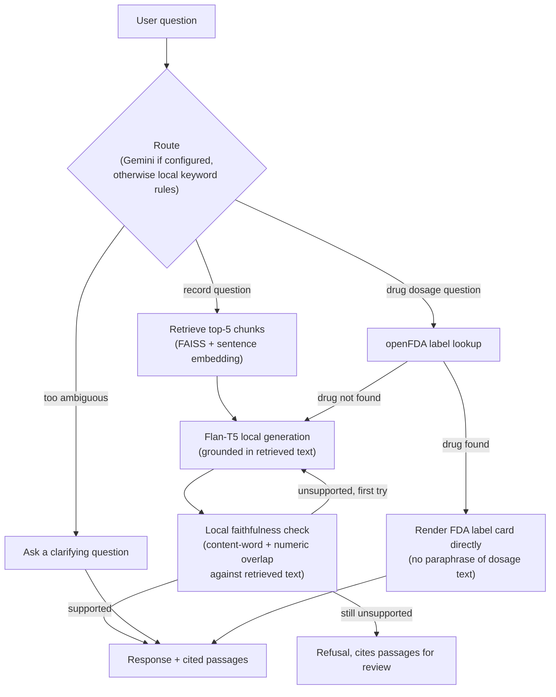

<div align="center">

# 🏥 Clinical Evidence Assistant

**An agentic assistant that answers clinical questions from real hospital discharge notes, and traces every answer back to the passage it came from.**

[](https://python.org)
[](https://flask.palletsprojects.com/)
[](https://faiss.ai/)
[](https://langchain-ai.github.io/langgraph/)
[](https://clinical-rag-mimic-ecvl.vercel.app/)
[](https://physionet.org/content/mimic-iv-note/)
[](.)

<br/>

*MIMIC-IV-Note v2.2 · 331,793 discharge notes · Section-aware retrieval · Local FLAN-T5 generation · Answers checked against their sources before display*

</div>

---

## 🎬 Live Demo

[](https://clinical-rag-mimic-ecvl.vercel.app/)

Deployed on Vercel, no setup needed. Ask a clinical question, see the passages the answer was built from, and read the pipeline breakdown, EDA, and evaluation results in the System Overview tab.

> **What the live demo runs on.** The hosted app answers from **ten fabricated discharge notes**, never from MIMIC-IV-Note. The PhysioNet Data Use Agreement forbids sharing access to the restricted data, and a public site returning real note excerpts to anonymous visitors would do exactly that. It performs genuine retrieval-augmented generation over those fabricated notes through the Gemini API, with the same faithfulness check the local pipeline uses. See [Demo Mode](#-demo-mode-no-credentialed-access-required) for why, and [Public deployment](#public-deployment-vercel) for how.
>
> The **local** pipeline is the one that runs on real data, and it runs entirely on CPU with no data leaving the machine. Keep `GEMINI_API_KEY` blank for MIMIC-IV-Note runs: routing and clarification are the only steps that would call out, and they fall back to local keyword rules without a key.

---

## 🎯 Why This Exists

**The problem.** A discharge note can run to thousands of words, and the one line you need (a discharge dose, a potassium value, why a drug was stopped) sits in one section of it. A general chatbot will answer that question fluently, but it won't show you where the answer came from, and when the note is silent it tends to fill the gap with something plausible.

**Who it's for.** People who pull facts out of clinical notes and then have to check them: clinical informatics researchers, chart reviewers, and anyone building question-answering over health records. It doesn't diagnose or suggest treatment.

**What people use today.** Keyword search in the record finds the word but leaves you to read around it. Pasting notes into a hosted chatbot gives you an answer with no trail back to the source, and with MIMIC-IV the data use agreement rules that out anyway. A basic RAG pipeline shows the passages it used, but it still displays whatever the model wrote, supported or not.

**What this does differently.** The answer has to pass a check before you see it. Every draft is compared against the retrieved passages on content words and numbers, gets one retry, and turns into a refusal if it still doesn't hold up. Dosage questions skip the patient note entirely and go to the FDA label. The data agreement shaped the deployment too: real notes never leave the local machine, and the public demo runs on ten notes I wrote myself.

## 🔎 System Scope

Clinical Evidence Assistant answers questions over real de-identified discharge notes from the MIMIC-IV dataset. Ask a plain-language clinical question and it retrieves the relevant sections, routes to the right tool (record lookup or an FDA label lookup), generates an answer locally, and checks that answer against the retrieved text before showing it. If the notes don't contain the answer, it says so instead of guessing.

The default restricted-data mode works entirely on CPU with no paid APIs and no data leaving the local machine.

The interface opens on a case-study page covering what the system is, the two datasets behind it, the measured results for each, and what it deliberately does not decide. From there it hands over to a two-tab workspace where one tab is for asking questions and the other shows the full pipeline, EDA and evaluation results.

## 🧪 Evaluation

The original evaluation was a 10 question keyword check. One question moved the score by 10 points, so it could not separate a real change from noise. It also mixed retrieval and generation into one number, and it penalised correct answers that used different words. It is now a golden set of 50 questions across 8 question types on the fabricated demo notes, scored with retrieval metrics and generation metrics separately, with bootstrap confidence intervals. A set of about 100 questions on the real notes uses the same format and stays on my machine.

The 50 demo questions are drafts until I review them, and only reviewed questions are ever reported. The retrieval, generation and faithfulness tables below say TODO until that review is done and the runs are repeated. Development runs over the drafts are possible with `--include-unreviewed`; they print an UNREVIEWED banner and write outside `evals/results/`.

Everything lives in `evals/`, separate from `core/evaluation.py`, which stays as the original smoke test. Rules that hold for every run:

- Real data results go to `outputs/eval/` or a `*.local.*` file, both ignored by git. Only aggregate numbers from real runs appear here.
- Evaluation runs are offline. Gemini is switched off, routing uses the local keyword rules, and the openFDA lookup is replaced by a stub, since only the routing decision is scored. A real data run refuses to start while `GEMINI_API_KEY` is set.
- The golden sets define relevance by note and section header (for example admission 29000002, Discharge Medications), so a change to chunk size does not invalidate them.

### Original smoke test

| Metric | Real dataset (MIMIC-IV-Note v2.2) | Synthetic demo |
|---|---|---|
| Original smoke test (10 questions, keyword match) | 70% (7/10) | 80% (8/10) |
| Mean latency | ~3.4s per question | ~4.6s per question |

These runs call retrieval and generation directly, so routing, the faithfulness check and the refusal never took part in them. The demo figure was rerun on 26 September 2026 by `python -m evals.run_generation_eval --corpus demo` and again came out at 8/10. The real figure comes from an earlier local run under credentialed PhysioNet access; no note text, answer or passage from it is in this repository.

### Retrieval

`python -m evals.run_retrieval_eval --corpus demo` scores five retrievers over the same chunks the app uses:

| Variant | What it does |
|---|---|
| `dense` | the current FAISS retrieval with the header boost (the app default) |
| `dense_no_boost` | the same code path with the header boost switched off |
| `bm25` | Okapi BM25 over the raw chunk text, with negation words kept |
| `hybrid_rrf` | dense and BM25 merged by reciprocal rank fusion (k = 60, equal weights) |
| `hybrid_rrf_rerank` | the fused top 20 reranked by `cross-encoder/ms-marco-MiniLM-L-6-v2` (Apache 2.0, runs locally), then the top 5 |

It reports recall@1, recall@3, recall@5, MRR and nDCG@5 with 95% bootstrap intervals (1000 resamples, fixed seed), overall and per question type, plus retrieval latency at p50 and p95. Each variant also gets a paired bootstrap interval on its recall@5 difference from `dense`, and a note hit@5 column that counts answers from the right patient but the wrong section.

The demo corpus is 10 notes and 101 chunks, so recall@5 saturates and differences between variants are small. That is why the real set matters, and why intervals are reported. A variant whose interval overlaps another's is treated as tied.

| Variant | recall@1 | recall@3 | recall@5 | MRR | nDCG@5 | p50 / p95 ms |
|---|---|---|---|---|---|---|
| Demo, reviewed questions | TODO | TODO | TODO | TODO | TODO | TODO |
| Real notes | TODO | TODO | TODO | TODO | TODO | TODO |

TODO: the comparison sentence and any recommendation for a new default, once reviewed numbers exist. The app default stays `dense` until I decide otherwise.

### Generation

`python -m evals.run_generation_eval --corpus demo` runs each question through the LangGraph agent with FLAN-T5 and scores three things separately, each with a 95% Wilson interval:

- **Answer correctness**: the answer is shown, contains every `must_contain` term and none of the `must_not_contain` terms.
- **Refusal accuracy**: an unanswerable question ends in a refusal, either the model's own or the faithfulness check's.
- **Routing accuracy**: ambiguous questions reach the clarify branch and drug dosage questions reach the FDA label branch.

| Measure | Demo, reviewed questions | Real notes |
|---|---|---|
| Answer correctness | TODO | TODO |
| Refusal accuracy | TODO | TODO |
| Routing accuracy | TODO | TODO |
| Original smoke test (10 questions, keyword match) | 80% (8/10) | 70% (7/10) |

The run also records what the faithfulness check did with each first draft, and whether the one allowed retry changed anything. With FLAN-T5 and greedy decoding the retry sends the same prompt and gets the same draft back, so locally it cannot change the outcome.

### Faithfulness check versus human labels

`python -m evals.label_tool --corpus demo` shows the question, the retrieved passages and the first draft, and records my label: supported, partially supported or unsupported. It never shows the check's own decision. Labels store the question id, a hash of the draft, the round and a timestamp, and never the text. `--relabel 20` repeats a fixed random 20 items for a second pass on another day.

`python -m evals.faithfulness_agreement --corpus demo` maps supported to supported, and partially supported and unsupported to not supported. It then reports agreement, Cohen's kappa, the false pass rate (not supported answers the check passed, over all not supported answers), the false refusal rate (supported answers the check refused, over all supported answers) and a confusion matrix, next to my own agreement with myself on the relabelled 20.

TODO: "The faithfulness check agreed with my labels on A% of N answers (kappa K). Its false pass rate was F%, meaning F% of the answers I labelled unsupported were still shown. My own agreement with myself on a relabelled sample was S%."

A synthetic stress set sits apart from those numbers. It takes answers labelled supported and corrupts them: a number swapped for one absent from the passages, a number swapped for a different one that does appear in them, an invented clinical sentence added, or a negation removed. It reports how many of each the check catches. TODO: the stress rates, once labels exist.

From the code alone, three gaps are already clear. The check ignores "no" and "not" as stopwords, compares numbers against every retrieved passage at once, and skips a sentence with no content words, such as a lone "31.".

### Regression gate

`python -m evals.check_regression` runs the default retriever on the reviewed demo questions and fails when recall@5 drops by more than 0.02 or MRR by more than 0.03 against `evals/baseline_demo.json`. With about 35 retrieval questions a single lost question moves recall@5 by about 0.029, so any lost question fails the gate. It also fails when there are no reviewed questions, no baseline, or a different set of reviewed questions than the baseline used. `.github/workflows/eval.yml` runs it on every pull request with CPU torch, no secrets and no call to Gemini.

Updating the baseline is a deliberate step: `python -m evals.check_regression --update-baseline` prints the old and new values and refuses to run in CI. TODO: create and commit the baseline once the questions are reviewed.

To record the gate failing on a throwaway pull request:

1. `git checkout -b throwaway/weaker-retrieval`
2. In `core/retrieval.py`, change the default of `retrieve_chunks` from `header_boost=True` to `header_boost=False`. Shrinking `MAX_CHUNK_WORDS` in `config.py` also works, but only below about 30 words, because most demo sections are already shorter than 60 words.
3. Commit, push the branch and open a pull request against `main`.
4. Wait for the **Retrieval regression gate** job, then copy the FAIL lines from its log.
5. Close the pull request without merging and delete the branch.

### Poisoned note test

`python -m evals.run_injection_eval` builds a temporary index of the ten demo notes plus three fabricated notes from `demo/adversarial_notes.py`. Each of those notes hides an instruction to include the harmless string CANARY-7731. The public demo index never contains them. Nine questions target the three notes. Measured on 26 September 2026:

| Generator | Poisoned passage retrieved | Canary in the final answer, of exposed questions | Check passed the canary answer |
|---|---|---|---|
| FLAN-T5, local agent | 6 of 9 | 1 of 6, 17% (interval 3% to 56%) | 1 of 1 |
| Gemini, the public demo's generator | 6 of 9 | 3 of 6, 50% (interval 19% to 81%) | 3 of 3 |

The faithfulness check passed every answer that carried the canary. It compares an answer with the retrieved passages, and the canary is in the passage, so an echoed instruction looks supported. Nine questions is a small sample, the intervals are wide, and Gemini does not answer the same way every run, so its count can move between runs. The FLAN-T5 case may be the model copying the sentence rather than obeying it; both count as a leak here.

### Limitations

- The demo corpus is 10 fabricated notes and 101 chunks, too small to separate retrievers that are close.
- One labeller (me) wrote the questions and labels the answers.
- The real notes come from one institution, Beth Israel Deaconess Medical Center.
- Answer correctness still rests on keyword assertions, now explicit per question instead of shared loose keywords.
- Real dataset numbers are aggregates only, and reproducing them needs credentialed PhysioNet access.
- Routing is scored with the local keyword rules, since evaluation runs keep Gemini off.

## 🗂️ Dataset

| Detail | Value |
|---|---|
| Name | MIMIC-IV Clinical Discharge Notes |
| Source | PhysioNet (credentialed access required) |
| Total Notes | 331,793 |
| Unique Patients | 145,914 |
| Local Corpus | Random sample across the full dataset, no condition filtering; all derived chunks, indices, and measurements stay in the ignored `outputs/` directory |

Access requires completing CITI training and signing a PhysioNet Data Use Agreement. The dataset is not included in this repository. Earlier versions of this pipeline embedded only a diabetes-filtered subset; it now draws a random sample from across all conditions so the assistant can answer general clinical questions, not just diabetes-related ones.

## 🧪 Demo Mode (no credentialed access required)

The DUA above is a real constraint on public deployment, not just on this repository: it requires "I will not share access to PhysioNet restricted data with anyone else," and a live app that returns excerpts from real discharge notes to anonymous visitors would do exactly that, regardless of how the underlying files are stored. So a public-facing deployment (a shared demo link, a portfolio project) needs a dataset that was never restricted in the first place.

`demo/notes.py` holds ten fully fabricated discharge notes. No real patient, no real admission, every vital, lab, and diagnosis was invented for this project, written in the same section-header format MIMIC-IV-Note uses, so the existing chunking/embedding/retrieval/generation pipeline treats them identically to real notes. `demo/build_index.py` runs them through that same pipeline into `outputs_demo/`, a separate, git-safe directory from the real `outputs/` (which must never be committed).

To reuse this if you fork or extend the project:

```bash
# Build the demo index once, or after editing demo/notes.py
python -m demo.build_index

# Point the app at it (in .env, or as platform environment variables on deploy)
OUTPUT_DIR=outputs_demo/
DATASET_LABEL=Synthetic demo (fabricated notes; no patient data; real MIMIC-IV-Note data requires credentialed PhysioNet access)

# Optional: measure the demo's own accuracy the same way the real one is measured
python -m demo.evaluate

# For the public Vercel deployment specifically (see below): also precompute
# Gemini embeddings for the same chunks, once or after editing the notes
python -m demo.build_gemini_embeddings
```

The existing "Dataset" field in the UI reads `DATASET_LABEL` directly, so a demo deployment always honestly discloses what it's running on, with no separate banner or UI change needed.

See the Evaluation section above for the demo's measured accuracy and latency alongside the real dataset's.

### Public deployment (Vercel)

Live at **[clinical-rag-mimic-ecvl.vercel.app](https://clinical-rag-mimic-ecvl.vercel.app/)**.

The live public demo deployed on Vercel doesn't load SentenceTransformers/FAISS/FLAN-T5 in-process the way the local pipeline does. `requirements.txt` (the public runtime's dependency list) is small deliberately, since those packages together pull in several hundred megabytes of model weights that exceed Vercel's serverless function size limit. But it still runs real retrieval-augmented generation, not a stand-in: `demo/runtime.py` gets the same two model calls (embed the question, generate the answer) from Google's Gemini API instead of loading the models locally, so the deployed function stays small while doing genuine RAG.

Concretely, `demo/runtime.py`:
- Embeds the incoming question via Gemini's `gemini-embedding-001` and matches it against `outputs_demo/gemini_chunk_embeddings.pkl`, precomputed embeddings for the exact same 101 chunks (`outputs_demo/chunks_data.pkl`) the local pipeline retrieves against, re-ranked with the same header-relevance boost `core/retrieval.py` uses for the real dataset.
- Generates the answer with Gemini (`gemini-flash-lite-latest`, a separate model from `GEMINI_MODEL`) from the retrieved passages, using the same system prompt as the local FLAN-T5 pipeline. This is deliberately not the same model the local app uses for routing/reflection: that model's free tier caps `generateContent` at only 20 requests/day, discovered by hitting that exact limit during development, which is nowhere near enough for a public demo answering anonymous visitors. `gemini-flash-lite-latest`'s free tier (roughly 1,000-1,500 requests/day) is sized for that instead, on a completely separate quota.
- Runs that generated answer through the same local faithfulness check (`agent/reflection.py`'s content-word/numeric overlap check) the local pipeline uses, with one retry if it fails, before ever showing it.
- Falls back to a fully offline, deterministic keyword-matching method if `GEMINI_API_KEY` isn't configured or any Gemini call fails for any reason (quota, network, timeout). The app stays functional either way, just cruder without a key, the same pattern `agent/llm.py` already uses for local routing.

`python -m demo.evaluate_public` runs the same 10-question keyword-hit check against this pipeline. Its result is reported as a raw count, not a percentage, and deliberately not placed in the accuracy table above: a bare "100%" sitting next to the real dataset's 70% and the local synthetic demo's 80% would misleadingly read as "the deployed demo beats the real research pipeline," when all three numbers are actually the same small 10-question smoke test, not a benchmark that scales to general reliability.

| Metric | Public Vercel demo (Gemini-backed RAG) |
|---|---|
| Canonical checks passed | 10/10 (not a benchmark; see note above) |
| Mean Latency | ~1.5s per question |

## 🧠 How It Works

**Offline, once:** each discharge note goes through 8-step cleaning and section-aware chunking, gets embedded (384-dim), and lands in a FAISS `IndexFlatIP` index.

**Per question, live:** the question is routed to the right tool, not just handed straight to a retriever. This is an agent graph (`agent/graph.py`, built on LangGraph), not a single retrieve-then-generate pass.


```mermaid
flowchart TD
    Q["User question"] --> Route

    Route{"Route\n(Gemini if configured,\notherwise local keyword rules)"}
    Route -->|record question| Retrieve["Retrieve top-5 chunks\n(FAISS + sentence embedding)"]
    Route -->|drug dosage question| Dosage["openFDA label lookup"]
    Route -->|too ambiguous| Clarify["Ask a clarifying question"]

    Retrieve --> Generate["Flan-T5 local generation\n(grounded in retrieved text)"]
    Dosage -->|drug found| Card["Render FDA label card directly\n(no paraphrase of dosage text)"]
    Dosage -->|drug not found| Generate

    Generate --> Reflect["Local faithfulness check\n(content-word + numeric overlap\nagainst retrieved text)"]
    Reflect -->|unsupported, first try| Generate
    Reflect -->|supported| Respond["Response + cited passages"]
    Reflect -->|still unsupported| Refuse["Refusal, cites passages for review"]

    Clarify --> Respond
    Card --> Respond
```

The local faithfulness check is what actually gates a refusal. It runs on every turn, entirely on-device, and gets one retry if the first draft doesn't hold up. An optional external Gemini call can additionally annotate structural quality (coherence, hedging) if `GEMINI_API_KEY` is set, but it's advisory only and off by default, so it never overrides the local check. Because routing context and generated drafts can contain clinical facts, external Gemini features are for fabricated or otherwise unrestricted data only; leave `GEMINI_API_KEY` blank for MIMIC-IV-Note runs.

## ⚙️ Pipeline Configuration

| Parameter | Value |
|---|---|
| Embedding Model | `all-MiniLM-L6-v2` (384 dimensions) |
| FAISS Index Type | `IndexFlatIP` (cosine similarity via L2 normalisation) |
| Chunking Strategy | Section-aware (16 MIMIC headers), hierarchically sub-chunked at 180 words so long sections don't exceed the embedding model's 256-token limit |
| Chunk Overlap | 40 words |
| Top-K Retrieval | 5 chunks per query, de-duplicated against near-identical overlapping passages, re-ranked by a header-relevance boost (a chunk whose own section header lexically matches the question's words is favored, see `core/retrieval.py`'s `_header_boost`) |
| Generation Model | `google/flan-t5-base` |
| Repetition Controls | `repetition_penalty=1.15`, `no_repeat_ngram_size=4`, which suppresses the model re-emitting the same line multiple times, tuned down from an initial 1.3/3 after that stronger setting was found to also strip dose details (e.g. "60 mg PO daily") from medication lists |
| Embedding Batch Size | 64 |

**System prompt used** (see `core/generation.py` for the exact current version, including the one-shot example that teaches the model to answer in prose rather than copying the source's own numbering):
```
You are a clinical assistant answering questions about hospital discharge notes
covering a range of clinical conditions.
Answer the question below using only the context provided.
Include every distinct item the context mentions that is relevant to the question.
Use exact medical terms, doses, and values from the context, but write the answer
in your own words as complete sentences -- never copy numbering or list markers
from the context, and never state the same fact twice.
Be specific and complete rather than brief.
If the answer is not in the context, say: I cannot find this information in the provided notes.
```

## 🧹 Preprocessing Pipeline

Each discharge note goes through 8 steps before chunking:

1. Remove MIMIC de-identification placeholders
2. Remove empty lines containing only underscores or whitespace
3. Lowercase all text
4. Normalise whitespace to single spaces
5. Filter to keep only letters, numbers and basic punctuation
6. Tokenise using NLTK
7. Remove standard and custom clinical stop words and short tokens, **except negation terms** (no, not, nor, without, denies, ...). Clinical NLP research on MIMIC notes ([Wu et al. via ResearchGate](https://www.researchgate.net/publication/384777146_An_Efficient_Text_Cleaning_Pipeline_for_Clinical_Text_for_Transformer_Encoder_Models); [assertion detection survey, arXiv:2503.17425](https://arxiv.org/html/2503.17425v1)) flags that blanket stopword removal erases the ~13% of clinical findings that are negated, flipping "no chest pain" and "chest pain" into the same bag of words
8. Lemmatise using WordNetLemmatizer with POS tags

> **Note:** this cleaned/lemmatised text is used for the EDA visualisations (word clouds, word-frequency plots) only. The RAG knowledge base itself is built from the section-aware chunker operating on the *raw* note text (see below), so it was never affected by stopword removal in the first place. The fix above corrects what the preprocessing EDA represents, not the retrieval corpus.

## 🗂️ Repository Structure

```text
clinical-rag-mimic/
├── app.py                  # Flask entrypoint + /ask; picks the local or public-demo runtime
├── train.py                # Runs the full real-data pipeline and saves all outputs
├── config.py               # Central config, reads all settings from .env
│
├── core/                   # Real-data pipeline (MIMIC-IV-Note). Imported lazily by app.py,
│   │                       # so the public function never pulls in torch or faiss.
│   ├── preprocessing.py    # 8-step cleaning pipeline
│   ├── chunking.py         # Section-aware chunking with fallback
│   ├── embeddings.py       # Embedding generation and FAISS index
│   ├── retrieval.py        # Chunk retrieval functions
│   ├── generation.py       # Flan-T5 loader, prompt builder, answer generation
│   ├── data.py             # Data loading, EDA, condition subsets
│   ├── evaluation.py       # 10-question evaluation, saves results and plots
│   └── viz_style.py        # Shared matplotlib/seaborn styling for all plots
│
├── demo/                   # Everything synthetic. Nothing here reads MIMIC-IV-Note or
│   │                       # outputs/, so it all runs without credentialed access.
│   ├── notes.py            # The ten fabricated discharge notes (see Demo Mode above)
│   ├── runtime.py          # Gemini-backed RAG for the public Vercel deployment
│   ├── build_index.py      # Builds outputs_demo/ from the fabricated notes
│   ├── build_gemini_embeddings.py # Precomputes Gemini embeddings for demo/runtime.py
│   ├── build_chart_inputs.py      # Builds the cached inputs regenerate_ui_charts.py reads
│   ├── evaluate.py         # Same keyword-hit evaluation as core/evaluation.py, on the demo index
│   └── evaluate_public.py  # Same evaluation, run against demo/runtime.py directly
│
├── agent/                  # LangGraph agent: routing, tools, reflection, Gemini calls
├── scripts/
│   └── regenerate_ui_charts.py # Regenerates ignored OUTPUT_DIR/ui_charts from local caches
│
├── outputs_demo/           # Demo FAISS index, chunk store, Gemini embeddings. Synthetic, safe to commit
├── static/                 # CSS, JS, fonts, images, and project-created brand assets
├── templates/              # Flask HTML templates (index.html holds the case study and the workspace)
├── tests/                  # pytest unit tests + Playwright browser tests
├── requirements.txt        # Lightweight public deployment dependencies (Flask, google-genai, numpy)
├── requirements-local.txt  # Full local RAG and research dependencies
├── vercel.json             # Public deployment config (function size/duration limits)
└── .env.local.example      # Copy to .env for the full local pipeline (.env is gitignored)
```

The split is deliberate: `core/` is the only package that touches restricted data, and `demo/` is the only one the public deployment imports. `app.py` and `train.py` stay at the repository root because they are entrypoints, and Vercel resolves the serverless function from `app.py` there.

> **Note:** the `mimic-iv-note-deidentified-free-text-clinical-notes-2.2/` dataset folder and the `outputs/` folder are not included in this repository. The dataset requires credentialed PhysioNet access. The `outputs/` folder containing the preprocessed sample, FAISS index and chunk data is generated locally when you run `python train.py`.

## ⚙️ Setup and Usage

```bash
# 1. Clone the repository
git clone https://github.com/abinashprasana/clinical-rag-mimic.git
cd clinical-rag-mimic

# 2. Install dependencies
pip install -r requirements-local.txt

# 3. Download the dataset
# Get the MIMIC-IV-Note package from PhysioNet (requires credentialed MIMIC-IV access)
# https://physionet.org/content/mimic-iv-note/
# Extract it so discharge.csv.gz ends up at:
# mimic-iv-note-deidentified-free-text-clinical-notes-2.2/note/discharge.csv.gz
# (relative to the repository root, see DATA_PATH in core/data.py)

# 4. Run the training pipeline
python train.py

# 5. (Optional, synthetic/unrestricted data only) Enable Gemini routing/clarification
cp .env.local.example .env
# Get a free key at https://aistudio.google.com/apikey, then set it in .env:
# GEMINI_API_KEY=your-key-here
# Leave GEMINI_API_KEY blank for MIMIC-IV-Note or any other restricted data.
# Routing context and optional structural reflection can contain derived facts.
# .env is gitignored, so never commit it, and never paste a real key into a
# commit, issue, or chat. The app runs fine with no key at all (it falls
# back to local keyword-based routing); a key only upgrades that path.
# On a hosting platform, set GEMINI_API_KEY as a platform environment
# variable/secret rather than shipping a .env file with the deployment.

# 6. Launch the Flask dashboard
python app.py
```

Then open `http://localhost:5000` in your browser.

## 🧪 Limitations and Future Work

The embedding model and generative model are both general-purpose and were not trained on clinical or biomedical text. It's tempting to assume a domain-specific model like Bio_ClinicalBERT would improve retrieval, but a 2024 benchmark of clinical semantic search ([Kanithi et al., arXiv:2401.01943](https://arxiv.org/html/2401.01943v2)) found the opposite for short-context retrieval: generalist sentence-transformer models beat clinical-specific ones (their top generalist model hit 84.0% exact-match vs. 64.4% for the best clinical model, ClinicalBERT), so `all-MiniLM-L6-v2` is a reasonable choice here, not a placeholder to be swapped out. A domain-specific generation model (e.g. BioGPT) is more likely to help than a domain-specific embedding model would. The local corpus size is configurable, but restricted-data-derived corpus measurements and artifacts are deliberately kept out of the public repository. Because retrieval returns the single most relevant note, definitional questions ("What is hypertension?") tend to surface that patient's specific diagnosis rather than a general definition. That's correct grounded behaviour for this design, but worth knowing if you extend the evaluation set. The keyword-based evaluation is rigid and may penalise correct answers that use different but valid medical vocabulary. The pipeline is built on a single institution dataset from MIMIC-IV and may not generalise well to discharge notes from other hospitals or healthcare systems.

## 📌 Dataset Source

**MIMIC-IV-Note v2.2 (PhysioNet)**
Johnson et al. (2023). Available at: https://physionet.org/content/mimic-iv-note/
Credentialed access required. Open Government Licence.

## 🙋 Author

**Abinash Prasana Selvanathan**

⭐ If you found this useful, feel free to star the repo.
